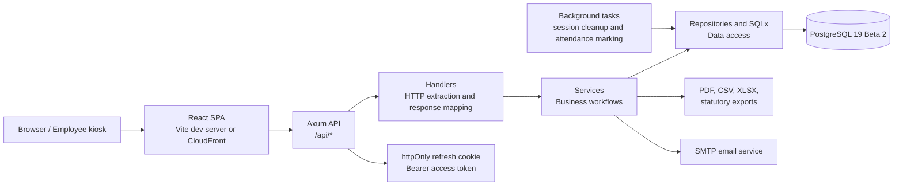

<div align="center">


# Payroll System

**A full-stack payroll and HR workflow system for small and medium-sized enterprises.**

[](https://github.com/siewong007/payroll-system/actions/workflows/ci.yml)
[](LICENSE)
[](backend/Cargo.toml)
[](frontend/package.json)
[](backend/Cargo.toml)
[](https://github.com/siewong007/payroll-system/commits/main)

</div>

## Project Overview 📌

Payroll System is an academic full-stack project that models common payroll and HR administration workflows for Malaysian SMEs. It provides employee management, monthly payroll processing, statutory contribution calculations, approval workflows, attendance tracking, employee self-service, reporting, and basic infrastructure automation.

The system is built as a React single-page application backed by a Rust Axum API and PostgreSQL database. It is suitable for a final-year project, portfolio demonstration, or software engineering case study. It should be evaluated as a learning and prototype system unless it has been independently reviewed for a real organization.

## Problem Statement

Many SMEs manage payroll, attendance, leave, claims, and statutory records across spreadsheets, messaging apps, and manual documents. This creates duplicated data entry, limited auditability, inconsistent approval records, and a higher risk of payroll errors. A centralized system can make these workflows more traceable and easier to review, while also demonstrating how modern web technologies can be applied to business process automation.

## Project Objectives

- Design a centralized payroll and HR workflow platform for SME daily operations.
- Implement role-based access for administrators, payroll staff, finance users, executives, and employees.
- Model payroll calculations with effective-dated EPF, SOCSO, EIS, and PCB data, guarded so unverified statutory rules cannot silently reach a production payroll run.
- Provide employee self-service features for payslips, leave, claims, overtime, attendance, and notifications.
- Record operational events through audit logs and approval states.
- Demonstrate a maintainable full-stack architecture using Rust, React, PostgreSQL, Docker, and Terraform.

## Key Features ✨

| Area | Implemented capabilities |
| --- | --- |
| Authentication | JWT access tokens, httpOnly refresh cookies, password reset, Google OAuth2 hooks, WebAuthn passkeys, multi-company switching |
| User and role management | Super admin company management, user management, role-aware frontend routing, company-scoped data access |
| Employee management | Employee CRUD, salary history, TP3 records, bulk import validation/confirmation, employee portal account creation |
| Payroll | Payroll groups, payroll run processing, draft submission, approval, return-for-changes, paid locking, manual payroll entries |
| Statutory payroll | Source-linked rule tables, fail-closed calculation services, statutory reports/exports, and EA forms; production PCB is disabled pending LHDN conformance |
| Attendance | QR attendance, kiosk credentials, Face ID mode setting, check-out, manual attendance, summaries, CSV export, geofence configuration |
| Employee portal | Profile, payslips, leave requests, claims, overtime requests, team calendar, notifications, attendance history |
| Approvals | Leave, claims, overtime, and payroll lifecycle approval actions |
| Documents and letters | Document records, categories, expiry tracking, email/letter templates, preview, sending logs |
| Reporting and audit | Dashboard summaries, payroll reports, leave/claims/statutory reports, audit trail |
| Operations | PostgreSQL 19 baseline/reference migrations, secure administrator bootstrap, Docker Compose, CI, and Terraform modules |

See the [implemented feature catalogue](docs/features.md) for end-to-end status,
configuration requirements, and known UI/security limitations.

## Tech Stack 🧰

| Layer | Technology |
| --- | --- |
| Frontend | React 19, TypeScript 7, Vite 8, Tailwind CSS 4, React Router, TanStack Query, Axios |
| Backend | Rust 2024, Axum 0.8, Tokio, SQLx, Tower HTTP, tower-governor |
| Database | PostgreSQL 19 Beta 2 |
| Auth and security | JWT, bcrypt, httpOnly cookies, WebAuthn, OAuth2, route-level rate limiting |
| Documents and exports | printpdf, rust_xlsxwriter, calamine, csv, lettre |
| DevOps | Docker Compose, GitHub Actions, Terraform, AWS-oriented infrastructure modules |

## Architecture



### Request Flow

```text
Browser -> Vite proxy or CloudFront -> Axum /api -> handler -> service -> repository -> PostgreSQL
```

Handlers are intended to stay thin. Business rules live in services, while database access is organized in repositories and SQLx-backed read modules.

The detailed living design is in [docs/architecture.md](docs/architecture.md),
and the schema/version contract is in [docs/database.md](docs/database.md).

## Project Structure

```text
payroll-system/
├── backend/
│   ├── migrations/
│   │   ├── 1000_schema.sql      # canonical schema + legacy reconciliation
│   │   └── 1001_data.sql        # safe defaults + prototype fixtures; no credentials
│   ├── src/
│   │   ├── core/                # config, auth, db, errors, app state
│   │   ├── handlers/            # Axum HTTP handlers
│   │   ├── models/              # DTOs and domain structs
│   │   ├── repositories/        # SQLx data access modules
│   │   ├── routes/              # all /api route definitions
│   │   ├── services/            # business logic and orchestration
│   │   └── tests/               # backend integration tests
│   ├── Cargo.toml
│   └── .sqlx/                    # committed offline query metadata
├── frontend/
│   ├── public/branding/         # project logo assets
│   └── src/
│       ├── api/                 # Axios API modules
│       ├── components/          # reusable UI components
│       ├── context/             # auth context/provider
│       ├── pages/               # route-level feature screens
│       ├── tests/               # frontend tests
│       └── types/               # TypeScript domain types
├── infra/                       # Terraform and deployment assets
├── docs/                        # project documentation
├── docker-compose.yml           # local PostgreSQL
├── README.md
├── CONTRIBUTING.md
└── LICENSE
```

## Installation Guide 🚀

### Prerequisites

- Docker and Docker Compose
- Rust stable toolchain
- Bun 1.3.14

### 1. Clone the Repository

```bash
git clone https://github.com/siewong007/payroll-system.git
cd payroll-system
```

### 2. Configure Environment Files

```bash
cp .env.example .env
```

The root `.env` is shared by Docker Compose and the backend. `dotenvy` finds it
when `cargo run` is started from the `backend/` directory, so a duplicate
`backend/.env` is neither needed nor recommended.

### 3. Start Local Services

```bash
docker compose up -d
```

This starts PostgreSQL 19 Beta 2 on `127.0.0.1:5434`. The non-default host port avoids
collisions with other local PostgreSQL projects. The backend automatically
applies the schema and reference-data migrations on startup.

PostgreSQL 19 Beta 2 is a pre-release testing build. Keep valuable data backed up and use a
major-version upgrade or dump/restore when moving an existing PostgreSQL volume to it.

### 4. Run the Backend

```bash
cd backend
cargo run
```

The API starts at `http://localhost:8080`.

### 5. Run the Frontend

Open a second terminal:

```bash
cd frontend
bun install
bun run dev
```

The frontend starts at `http://localhost:5173` and proxies `/api` requests to the backend.

### 6. Verify the Setup

```bash
curl http://localhost:8080/api/health
```

Expected response:

```text
ok
```

## Environment Variables

The main example file is [.env.example](.env.example).

| Variable | Required | Description |
| --- | --- | --- |
| `POSTGRES_DB` | Local compose | PostgreSQL database name |
| `POSTGRES_USER` | Local compose | PostgreSQL username |
| `POSTGRES_PORT` | Local compose | PostgreSQL host port (defaults to `5434`) |
| `POSTGRES_PASSWORD` | Local compose | PostgreSQL password |
| `DATABASE_URL` | Backend | PostgreSQL connection string |
| `JWT_SECRET` | Backend | Secret used to sign JWTs |
| `JWT_EXPIRY_HOURS` | Backend | Access token lifetime in hours |
| `RUST_LOG` | Backend | Rust tracing/logging configuration |
| `SERVER_HOST` | Backend | Backend bind host |
| `SERVER_PORT` | Backend | Backend bind port |
| `FRONTEND_URL` | Backend | Allowed frontend origin and email link base URL |
| `WEBAUTHN_RP_ID` | Backend | WebAuthn relying party ID |
| `WEBAUTHN_RP_ORIGIN` | Backend | WebAuthn origin URL |
| `GOOGLE_CLIENT_ID` | Optional | Google OAuth2 client ID |
| `GOOGLE_CLIENT_SECRET` | Optional | Google OAuth2 client secret |
| `SMTP_HOST` | Optional | SMTP server hostname |
| `SMTP_PORT` | Optional | SMTP server port |
| `SMTP_USERNAME` | Optional | SMTP username |
| `SMTP_PASSWORD` | Optional | SMTP password |
| `SMTP_FROM_EMAIL` | Optional | Sender email address |
| `SMTP_FROM_NAME` | Optional | Sender display name |
| `VITE_API_URL` | Optional frontend | External API base URL when not using the Vite proxy |

## Create the Initial Administrator

The database deliberately contains no demo users or known password. After the
backend migrations have run, create the first company and super administrator
once with the bootstrap command:

```bash
cd backend
export BOOTSTRAP_COMPANY_NAME="Example Company Sdn Bhd"
export BOOTSTRAP_ADMIN_NAME="System Administrator"
export BOOTSTRAP_ADMIN_EMAIL="admin@example.com"
read -s BOOTSTRAP_ADMIN_PASSWORD && export BOOTSTRAP_ADMIN_PASSWORD
cargo run --bin bootstrap_admin
unset BOOTSTRAP_ADMIN_PASSWORD
```

The command enforces the application password policy, serializes concurrent
attempts, and refuses to run after an active super administrator exists. Do not
put bootstrap credentials in migration files or commit them to `.env`.

## Usage Examples

### Log in

```bash
curl -s -X POST http://localhost:8080/api/auth/login \
  -H "Content-Type: application/json" \
  -d '{"email":"admin@example.com","password":"<your-password>"}'
```

Copy the returned token into authenticated requests:

```bash
curl -s http://localhost:8080/api/employees \
  -H "Authorization: Bearer <access-token>"
```

### Process a Payroll Run

```bash
curl -s -X POST http://localhost:8080/api/payroll/run \
  -H "Authorization: Bearer <access-token>" \
  -H "Content-Type: application/json" \
  -d '{
    "payroll_group_id": "<payroll-group-uuid>",
    "period_year": 2026,
    "period_month": 1,
    "notes": "January payroll test run"
  }'
```

### View Attendance Summary

```bash
curl -s "http://localhost:8080/api/attendance/summary?date_from=2026-01-01&date_to=2026-01-31" \
  -H "Authorization: Bearer <access-token>"
```

## API Endpoint Documentation 🔌

All backend endpoints are nested under `/api`. Most endpoints require `Authorization: Bearer <access-token>` unless marked as public.

| Module | Representative endpoints |
| --- | --- |
| Health | `GET /api/health`, `GET /api/health/ready` |
| Auth | `POST /api/auth/login`, `POST /api/auth/refresh`, `POST /api/auth/logout`, `PUT /api/auth/change-password`, `PUT /api/auth/switch-company` |
| Passkeys and OAuth2 | `POST /api/auth/passkey/register/begin`, `POST /api/auth/passkey/authenticate/begin`, `GET /api/auth/oauth2/providers`, `GET /api/auth/oauth2/google/callback` |
| Admin | `GET/POST /api/admin/companies`, `GET/POST /api/admin/users`, `PUT /api/admin/users/{id}/companies` |
| Employees | `GET/POST /api/employees`, `GET/PUT/DELETE /api/employees/{id}`, `GET /api/employees/{id}/salary-history`, `POST /api/employees/import/validate` |
| Payroll | `POST /api/payroll/run`, `GET /api/payroll/runs`, `GET /api/payroll/runs/{id}`, `PUT /api/payroll/runs/{id}/approve`, `PUT /api/payroll/runs/{id}/lock` |
| Payroll entries | `GET/POST /api/payroll/entries`, `PUT/DELETE /api/payroll/entries/{id}` |
| Portal | `GET /api/portal/profile`, `GET /api/portal/payslips`, `GET/POST /api/portal/leave/requests`, `GET/POST /api/portal/claims`, `GET/POST /api/portal/overtime` |
| Approvals | `GET /api/approvals/leave`, `PUT /api/approvals/leave/{id}/approve`, `GET /api/approvals/claims`, `GET /api/approvals/overtime` |
| Attendance | `POST /api/attendance/qr/generate`, `POST /api/attendance/check-in/qr`, `POST /api/attendance/check-out`, `GET /api/attendance/summary`, `GET /api/attendance/export` |
| Kiosk | `POST /api/attendance/kiosk/qr`, `GET/POST /api/attendance/kiosks`, `DELETE /api/attendance/kiosks/{id}` |
| Calendar and teams | `GET/POST /api/calendar/holidays`, `POST /api/calendar/import-ics`, `GET/POST /api/teams`, `GET/POST /api/teams/{id}/members` |
| Documents and email | `GET/POST /api/documents`, `GET/POST /api/email/templates`, `POST /api/email/preview`, `POST /api/email/send` |
| Reports | `GET /api/reports/payroll-summary`, `GET /api/reports/leave`, `GET /api/reports/statutory`, `GET /api/reports/ea-form` |
| Audit and backup | `GET /api/audit-logs`, `GET /api/admin/backup/export`, `POST /api/admin/backup/import` |
| Work schedules and geofence | `GET /api/work-schedules`, `GET/PUT /api/work-schedules/default`, `GET/POST /api/geofence/locations`, `GET/PUT /api/geofence/mode` |

## Roadmap and Future Improvements 🗺️

- Publish a formal OpenAPI specification for backend endpoints.
- Add end-to-end browser tests for core payroll, attendance, and portal workflows.
- Import independently verified official EPF/SOCSO/EIS schedules and add LHDN PCB conformance tooling.
- Strengthen Face ID attendance with stricter server-side WebAuthn assertion verification.
- Improve accessibility testing and keyboard navigation coverage.
- Add Malay/English localization support.
- Add more detailed deployment documentation for non-AWS environments.
- Add dashboard analytics for payroll cost trends and attendance exceptions.

## Limitations

- This project is not presented as production-ready payroll software.
- Statutory calculations and seeded rate tables should be reviewed against current official requirements before real-world use.
- Email, OAuth2, WebAuthn, and cloud deployment require environment-specific configuration.
- Face ID attendance currently relies on authenticated session context and credential information; it is not a full biometric verification service.
- File uploads are stored locally unless deployment storage is configured separately.
- Security, compliance, backup, and disaster-recovery controls require further review before organizational adoption.

## Contributing

Contributions are welcome for learning, review, and project improvement. Please read [CONTRIBUTING.md](CONTRIBUTING.md) before opening an issue or pull request.

Recommended checks before a pull request:

```bash
cd backend
cargo fmt --check
cargo clippy -- -D warnings
cargo test
```

```bash
cd frontend
bun run lint
bun run test
bun run build
```

## License

This project is licensed under the [MIT License](LICENSE).

## Acknowledgements

- Rust, Axum, SQLx, and Tokio for the backend foundation.
- React, Vite, Tailwind CSS, and TanStack Query for the frontend stack.
- PostgreSQL for local service infrastructure.
- The Malaysian payroll statutory concepts used as the basis for the academic prototype.
