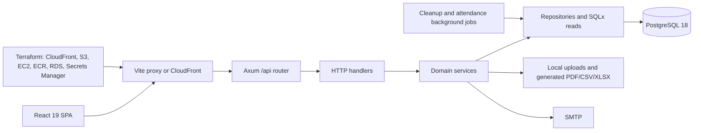

# Architecture, Security, and Enhancement Review

Date: 2026-07-14  
Scope: Rust backend, React frontend, PostgreSQL schema, local containers, CI/CD, and AWS Terraform

## Executive summary

The project has a sensible full-stack shape and several good security foundations: short-lived JWT access tokens, hashed and rotated refresh tokens, exact-origin CORS, parameterized SQL, private AWS storage, encrypted RDS, and a meaningful CI pipeline. The main architectural weakness is that authorization and tenant isolation are enforced by convention inside individual handlers and queries instead of by a deny-by-default boundary. Several omissions are therefore directly exploitable.

Do not treat the current build as production-safe until the P0 items below are fixed. In particular, a fresh database receives publicly documented administrator credentials; ordinary employee accounts can reach employee-management APIs; backup import can overwrite another tenant and write outside the upload directory; and the Face ID attendance route does not verify a biometric/WebAuthn assertion.

## Architecture map

- Request flow: browser -> Vite/CloudFront -> Axum route -> handler -> service -> repository/SQLx -> PostgreSQL.
- The frontend keeps the access token in memory. The refresh token is a hashed, rotated server-side session represented by an HttpOnly, SameSite=Strict cookie.
- Tenant isolation depends on `company_id` in JWT claims and query predicates. PostgreSQL row-level security is not used.
- Authorization checks are distributed across handlers. The central router does not apply an authenticated or deny-by-default policy to private route groups.
- Upload code writes to local `uploads/`, while Terraform provisions a private S3 upload bucket that the backend does not use. Container replacement can therefore lose uploaded files.
- Cleanup and auto-absence jobs run inside the API process. Horizontal replicas would execute duplicate jobs without leader election or distributed locks.
- Redis is present in local Compose but unused by the application.

## Confirmed vulnerabilities

### P0: release blockers

1. **Known privileged credentials are installed in every empty database.** `backend/src/core/db.rs:12` applies `seed_if_needed`; `backend/migrations/seed/001_seed.sql:224` creates demo privileged accounts using the public `admin123` password documented in `README.md:220`. A fresh production database is immediately exposed.

2. **Employee-management APIs lack HR/admin authorization.** List, get, create, update, delete, balance initialization, and carry-forward routes in `backend/src/handlers/employee.rs:78`, `:117`, `:134`, `:216`, `:246`, and `:290` require authentication and company context but not an HR/admin permission. Employee records include identity, address, contact, and bank data; redaction only removes payroll fields. An employee token can enumerate coworkers and invoke destructive mutations.

3. **Backup import can overwrite another tenant.** `backend/src/handlers/backup.rs:68` validates an admin role but discards the caller's company. `backend/src/services/backup_service/import.rs:24` selects the restore target globally using the uploaded company name, then `:105` cascade-deletes it. A tenant administrator can target another company by name.

4. **Backup files permit path traversal and arbitrary writes.** `backend/src/services/backup_service/files.rs:51` accepts backup-controlled keys, strips a URL prefix, joins the remainder to `uploads/`, and writes it without rejecting `..`, absolute paths, symlinks, or paths outside the storage root.

5. **Document deletion has the corresponding arbitrary-file-delete path.** `backend/src/services/document_service.rs:69` joins a caller-controlled `file_url` suffix to `uploads/` and removes it without canonical-containment validation.

6. **Payroll items are vulnerable to cross-tenant object access.** `backend/src/handlers/payroll.rs:390`, `backend/src/services/payroll_service.rs:38`, and `backend/src/repositories/payroll_items.rs:95` authorize the payroll role but select only by run UUID. The caller's company is never checked.

7. **Face ID check-in verifies no Face ID or WebAuthn proof.** `backend/src/handlers/attendance.rs:181` accepts any nonempty `credential_id`; the supplied assertion is not verified for challenge, signature, credential ownership, freshness, counter, or replay.

8. **Employee onboarding uses predictable passwords and the forced change is client-side.** `backend/src/services/employee_service.rs:115` uses the employee IC number or shared `Welcome@123`, returns it in plaintext, and sends it by email. Login grants a JWT and refresh session immediately. `must_change_password` is not enforced by the JWT extractor, and `backend/src/handlers/auth.rs:211` lets the user skip it.

9. **ICS URL import is an SSRF primitive.** `backend/src/handlers/calendar.rs:149` accepts an arbitrary URL and `backend/src/services/calendar_service.rs:236` fetches it without scheme, destination, private/link-local IP, redirect, DNS-rebinding, or response-size controls. The route's helper also admits the `exec` role. Terraform does not explicitly require EC2 IMDSv2.

### P1: high/medium risks

10. **Uploaded employee documents are publicly retrievable.** `backend/src/handlers/portal.rs:445` has no authentication, ownership, or tenant check. UUID filenames provide obscurity, not authorization.

11. **Normal password changes leave refresh sessions active.** `backend/src/services/auth_service.rs:142` updates the password without revoking sessions. Password-reset code already revokes them, showing the intended safer behavior.

12. **`/admin/users` lacks an explicit admin check.** `backend/src/handlers/admin.rs:64` accepts any authenticated caller, while `backend/src/services/user_service.rs:75` assumes non-super-admin callers are administrators.

13. **Mutation permissions conflict with the documented read-mostly executive role.** Approval and calendar helpers admit `exec`; broad non-employee checks also allow finance/executive users to mutate documents or templates.

14. **Historical plaintext secrets remain in Git history.** Commit `f4762be` removed deployment scripts containing SMTP/Gmail credentials, but deletion does not remove prior blobs. Rotation status cannot be verified from this repository.

15. **Other export-injection surfaces remain.** Attendance CSV fields are now neutralized, but browser-generated report CSV and statutory exports still accept employee-controlled spreadsheet fields. Leave ICS generation inserts summary/reason without calendar escaping.

## Hardening opportunities

- Centralize authentication and action-level permissions in separate public, employee, HR/admin, and payroll routers.
- Treat `company_id` as a mandatory typed tenant context and require it in every company-owned repository method. Add PostgreSQL RLS as defense in depth.
- Revoke sessions on password, role, company-membership, and account-status changes; atomically consume refresh tokens and detect token-family reuse.
- Move documents to private S3 objects and authorize each download, or issue short-lived, tenant-scoped presigned URLs.
- Enforce `Secure` cookies in production instead of deriving the flag from a URL string.
- Enforce the CloudFront CSP after report-only telemetry is clean.
- Trust forwarding headers only from known proxies, and avoid storing full employee objects in audit metadata.
- Gate production deployment on successful CI and an application health check with rollback.
- Protect background jobs with idempotency and a distributed lock before adding API replicas.

OWASP recommends permission checks on every request and explicit authorization for static resources; it also recommends generated filenames, safe storage, file authorization, size controls, and containment for uploads. See the [OWASP Authorization Cheat Sheet](https://cheatsheetseries.owasp.org/cheatsheets/Authorization_Cheat_Sheet.html) and [File Upload Cheat Sheet](https://cheatsheetseries.owasp.org/cheatsheets/File_Upload_Cheat_Sheet.html).

## Dependency review

- The repository received a broad dependency update on 2026-07-13 (`b954113`) and a frontend/TypeScript refresh later that day (`00ad40e`). Installed direct dependencies match the current lockfiles; no unvalidated manifest bump was made in this review.
- A local Cargo audit used a RustSec database updated on 2026-07-13 and inspected 524 locked packages. It reported two advisories already documented in CI:
  - `RUSTSEC-2026-0187` through `printpdf -> lopdf 0.39`. The vulnerable API parses untrusted PDFs; this application only generates PDFs and contains no `lopdf::Document::load*` call. The current risk is not reachable through reviewed application behavior, but the transitive dependency should still be upgraded when `printpdf` permits `lopdf >=0.42`.
  - `RUSTSEC-2023-0071` through `jsonwebtoken -> rsa 0.9.10`. This application creates and verifies HS256 tokens, so the RSA private-key timing path is not used. RustSec currently lists no patched `rsa` version for this advisory.
- Informational transitive warnings include unmaintained `bincode 1.3.3`, `proc-macro-error`, `proc-macro-error2`, and `ttf-parser`; all enter through `printpdf` or validator derive chains.
- After explicit user approval, the live frontend registry audit/outdated check was still blocked by tenant policy because it would disclose the project's dependency names and versions to a public registry. No workaround was attempted. The last repository audit evidence says the React Router high-severity advisories were cleared by `144d237`, but that is not a substitute for a current registry audit, so the frontend's current registry vulnerability status remains unverified. The project now uses Bun for installs, scripts, lockfile management, and the CI audit command.

References: [RustSec `lopdf` advisory](https://rustsec.org/advisories/RUSTSEC-2026-0187.html), [RustSec RSA advisory](https://rustsec.org/advisories/RUSTSEC-2023-0071.html).

## Test work completed

### Backend

- Added 37 database-free tests for JWT/RBAC, cookies, error masking, PKCE, password policy, payroll validation and rounding, leave proration, imports, role normalization, and audit metadata.
- Replaced floating-point import-money parsing with exact `Decimal` parsing and overflow checks.
- Fixed age calculation around leap-year offsets and February 29 birthdays.
- Neutralized attendance CSV formula prefixes and covered the behavior with regression tests.
- Result: 88 passed, 0 failed. Formatting, all-target checking, and Clippy with warnings denied pass.
- Limitation: database-backed tests returned early because PostgreSQL was unavailable. CI must run them against PostgreSQL 18.

### Frontend

- Expanded API-client tests for token isolation, authorization preservation, refresh/retry, concurrent 401 queuing, kiosk behavior, and failure cleanup.
- Expanded auth-provider tests for restoration, login, logout, kiosk bypass, company switching, and query-cache invalidation.
- Added role, utility, WebAuthn conversion, Modal, and TimeSelector tests.
- Fixed the empty TimeSelector fallback uncovered by the tests.
- Result: 31 passed, 0 failed. TypeScript and ESLint pass.
- Remaining gaps: page-level React Query workflows, full router/RoleGuard integration, DataTable behavior, and browser-level attendance/passkey flows.

## Graphify installation

- Graphify CLI detected at version `0.9.11`.
- Installed the Graphify Codex skill and repository post-commit/post-checkout hooks.
- Generated `graphify-out/graph.json`, `GRAPH_REPORT.md`, and `graph.html`.
- Final graph: 3,946 nodes, 9,946 edges, and 220 communities. The benchmark estimated roughly 67x lower token use for typical codebase queries.

## Prioritized enhancement plan

### P0: security release (before production use)

1. Make demo data an explicit development-only command; delete/rotate all seeded accounts in every deployed database.
2. Add centralized, deny-by-default route permissions and a role-by-route integration matrix.
3. Bind backup operations to an explicit authorized tenant; prevent overwrite by name; validate and sign backup packages.
4. Require canonical file containment and safe generated object keys for every read/write/delete path.
5. Scope payroll items and every identifier-based query to the caller's company.
6. Replace the Face ID UX signal with a verified, one-time WebAuthn assertion or rename/remove the feature.
7. Replace default passwords with random, expiring, single-use activation links and enforce onboarding state server-side.
8. Remove URL-based ICS import or introduce a hardened outbound-fetch service. Require IMDSv2.

### P1: reliability and maintainability (next 1-2 sprints)

1. Move uploads to private S3 with ownership metadata, encryption, malware/CDR processing, and authenticated downloads.
2. Add PostgreSQL-backed cross-tenant tests for every resource type; make missing test DB a hard CI failure.
3. Introduce session versioning, atomic refresh rotation, reuse detection, and revocation on security-sensitive changes.
4. Add repository interfaces/transaction boundaries around payroll, backup, onboarding, and approval workflows.
5. Move background jobs to a single worker or add distributed leases and idempotency keys.
6. Remove unused Redis/Terraform resources or integrate them intentionally.

### P2: operational maturity (following 2-4 sprints)

1. Add coverage thresholds, browser tests for payroll/attendance/passkeys, Terraform validation, container scanning, and deployment smoke/rollback tests.
2. Add Dependabot/Renovate, SBOM generation, lockfile audits, and an exception expiry/review process for ignored advisories.
3. Encrypt or tokenize IC, bank, and tax identifiers; define retention, masking, export, and audit-redaction rules.
4. Add request IDs, immutable security-event logging, anomaly alerts, backup restore drills, and payroll reconciliation controls.
5. Version statutory rates and calculation policies with effective dates and reproducible payroll-run snapshots.
