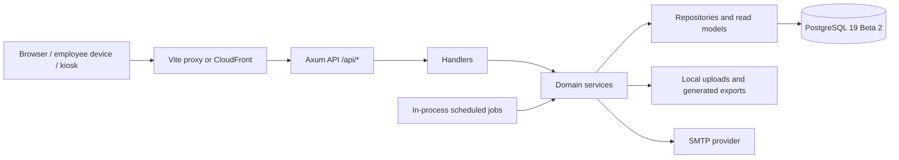
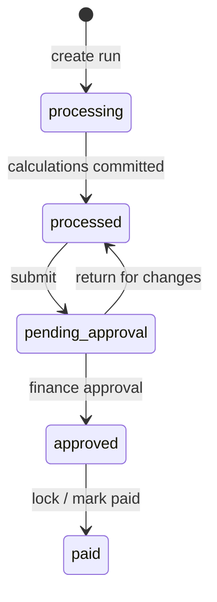

# System architecture

This is the living architecture reference for the implemented payroll and HR
system. Feature completeness and known UI gaps are tracked separately in
[features.md](features.md); the database baseline and upgrade contract are in
[database.md](database.md).

## System context

The React single-page application calls one Axum API. During development Vite
proxies `/api`; the AWS design serves the frontend through CloudFront and runs
the API separately. All backend routes are declared in
`backend/src/routes/mod.rs`.

## Backend boundaries

| Layer | Responsibility |
| --- | --- |
| `handlers/` | HTTP extraction, authentication context, permission checks, validation, and response mapping |
| `services/` | Business rules, workflow orchestration, transaction boundaries, and audit intent |
| `repositories/` | One-table SQL operations, generally generic over a SQLx executor |
| `repositories/reads/` | Cross-table projections, reports, and other denormalized read models |
| `models/` | API/domain structures and SQLx result projections |
| `core/` | Configuration, database startup, JWT extraction, cookies, shared state, and error mapping |

Request-time SQL belongs in repositories. A service may pass either a pool or
an open transaction to repository functions. `AppResult<T>` is the common
error boundary; database errors convert to `AppError::Database`, while internal
details are logged rather than exposed in HTTP 500 responses.

The API process also owns two operational jobs:

- expired or revoked refresh-token cleanup every 24 hours;
- hourly attendance evaluation that marks eligible employees absent around
  12:30 PM Asia/Kuala_Lumpur, excluding approved leave and public holidays.

These jobs are suitable for the current single API instance. Multiple replicas
would need a database lease, leader election, or a separate worker.

## Identity, roles, and tenancy

Access tokens are signed JWTs sent as bearer tokens. Refresh tokens are opaque,
rotated, hashed in PostgreSQL, and carried by an httpOnly cookie. The frontend
keeps the access token in memory; local storage contains only a display/session
hint and is not an authorization source.

Canonical roles are `super_admin`, `admin`, `payroll_admin`, `hr_manager`,
`finance`, `exec`, and `employee`. Payroll actions use explicit permissions:

| Action | Roles |
| --- | --- |
| View payroll | `super_admin`, `payroll_admin`, `finance` |
| Prepare and edit a draft | `super_admin`, `payroll_admin` |
| Submit for approval | `super_admin`, `payroll_admin` |
| Approve or return | `super_admin`, `finance` |
| Mark paid | `super_admin`, `finance` |

Company users carry an active `company_id` claim. Repository calls for
company-owned data are expected to include it. A multi-company user switches
context through `PUT /api/auth/switch-company`, which issues a new JWT instead
of trusting a client-supplied tenant on every request. PostgreSQL row-level
security is not currently used, so application-level tenant predicates and
authorization tests remain critical.

A fresh database contains no login credential. The explicit one-time
`bootstrap_admin` binary creates the initial company and super administrator,
serializes concurrent attempts, and refuses to run once an active super admin
exists.

## Payroll workflow

After a statutory preflight succeeds, the payroll engine executes in a
transaction and composes EPF, SOCSO, EIS, and PCB services for every eligible
employee. Money is stored as integer sen in the
database and represented with exact decimal types where fractional arithmetic
is required; payroll code must never use binary floating point.

The database enforces at most one non-cancelled run for a company, payroll
group, year, and month. This closes the race between the service's existence
check and concurrent inserts. A processed run permits controlled PCB edits;
submission, approval, return, payment, and eligible-run deletion each verify company scope
and legal state transitions. Outputs include payslip PDFs, batch PDFs, reports,
EA forms, and statutory export files.

Every statutory lookup row is linked to a `statutory_rule_sets` record with an
effective interval and source-verification metadata. Prototype or unlinked rows
are never eligible for automatic calculations, and missing data raises a visible
validation error instead of silently returning zero. The inherited 2024 rows in
`1001_data.sql` are explicitly unverified academic fixtures. Automatic PCB is
also disabled in production until its algorithm and input model pass LHDN
computerised-MTD conformance testing.

Tenant ownership is also enforced below the service layer for critical paths:
attendance, payroll-run/group/entry, user/employee, claims, leave, overtime,
documents, and employee schedules use company-qualified foreign keys. Payroll
items, leave balances, and team membership lack a stored company column, so
write-time constraint triggers compare their parents' companies.

## Attendance workflow

Attendance supports authenticated employee check-in, public kiosk display, and
HR administration.

- QR tokens are multi-use for their server-returned TTL. The `used` flag means
  administratively revoked, not consumed by an employee scan.
- Check-out selects the most recent open record within 24 hours so overnight
  shifts do not break at midnight.
- Geofence mode can be `none`, `warn`, or `enforce`; database checks protect
  latitude, longitude, and positive radii.
- The summary read model left-joins employees, so employees with no attendance
  rows still appear. The same filters feed CSV export.
- Manual records and corrections are HR/admin operations and are audit logged.

The option labelled Face ID is currently an authenticated convenience flow,
not server-verified biometric proof. See [features.md](features.md) and
[SECURITY.md](../SECURITY.md).

## Employee and approval workflows

Employee administration covers core employment, contact, payroll, bank,
statutory, salary-history, TP3, work-schedule, and portal-account data. Bulk
import is a two-phase workflow: validate an uploaded CSV/XLSX file, persist a
short-lived validation session, then confirm the accepted rows.

Employees can submit leave, claims, and overtime from the portal. HR-facing
approval screens can create, edit, approve, reject, cancel, and review those
records according to the relevant service rules. Leave balances, team calendars,
notifications, attachments, and audit records connect these workflows.

Company creation transactionally provisions the minimum configuration needed
for these flows: a default payroll group, standard leave types, Monday-Friday
working days, a default work schedule, and editable company settings. The same
idempotent database function repairs missing setup in older companies/backups.

## Frontend structure

`frontend/src/App.tsx` defines two authenticated shells:

- `AppLayout` for company administration, HR, payroll, reports, and operations;
- `PortalLayout` for employee profile, payslips, leave, claims, overtime,
  calendar, notifications, and attendance history.

Public routes handle login/password recovery and attendance kiosk/scan flows.
Role guards control navigation and page entry, while the API remains the
authoritative permission boundary. All API modules use the single Axios client
in `frontend/src/api/client.ts`. Its 401 interceptor performs one queued refresh
for concurrent failures, then clears the session if refresh fails. React Query
defaults to one retry, a 30-second stale time, and no focus refetch.

## Data and deployment

The canonical database consists of one schema migration and one reference-data
migration. It uses native UUIDv7 identifiers, targeted partial/covering/trigram
indexes, relational constraints, and multicolumn optimizer statistics. See
[database.md](database.md) for exact compatibility and verification rules.

Docker Compose and CI pin PostgreSQL 19 Beta 2. The repository also contains
AWS Terraform for networking, EC2/ECR, CloudFront/S3, Secrets Manager, and an
RDS deployment. Standard RDS does not yet offer a production PostgreSQL 19
engine, so that module deliberately remains on 18.4 as a documented provider
exception. The Lightsail deployment record is in
[lightsail-pg19-beta2-upgrade-record.md](lightsail-pg19-beta2-upgrade-record.md).

Uploads are still written to the API container's local `uploads/` directory;
the provisioned S3 upload bucket is not wired into the backend. SMTP, OAuth2,
WebAuthn origins, and cloud services require environment-specific configuration.

## Architectural invariants

- Keep handlers thin and put business rules in services.
- Keep request-time SQL in repositories or read-model modules.
- Require company scope for every tenant-owned identifier lookup.
- Use exact decimal/integer money representations, never `f64`.
- Interpret business dates and schedules in Asia/Kuala_Lumpur; store instants
  as UTC-aware timestamps.
- Preserve payroll and attendance state-machine checks at both service and
  database boundaries.
- Use the existing frontend HTTP client and role model rather than introducing
  parallel authentication state.
